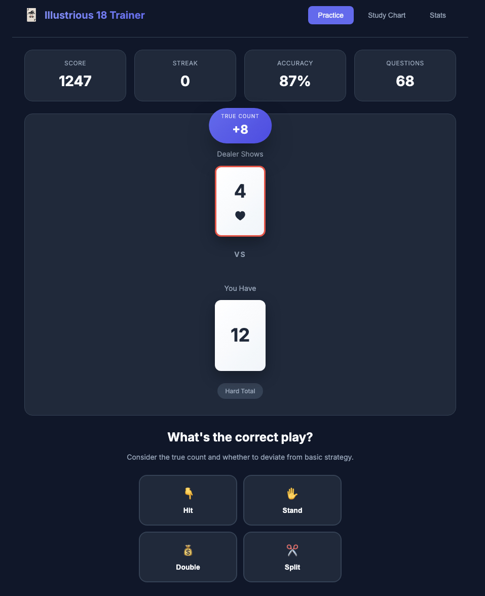

# Illustrious 18 Trainer

A professional web-based training application for mastering the Illustrious 18 - the 18 most important card counting deviations in blackjack.



## What are the Illustrious 18?

The Illustrious 18 are the 18 most valuable index plays in the Hi-Lo card counting system. They represent deviations from basic strategy that become profitable when the true count reaches certain thresholds. Mastering these deviations can significantly improve your edge at the blackjack tables.

## Features

### 🎮 Practice Mode
- Random scenarios with varying true counts
- Edge case training - questions where the true count is close to the index
- Immediate feedback with detailed explanations
- Score tracking and streaks

### 📚 Study Chart
- Complete reference of all 18 deviations
- Filterable by hand type (hard, soft, pairs, insurance)
- Quick lookup for index numbers

### 📊 Statistics
- Track your accuracy over time
- Identify weak spots that need more practice
- Best streak tracking
- Persistent storage of your progress

### 🎯 Edge Case Learning
The app specifically includes scenarios where the true count is close to the index number (±1, ±2). This helps you understand:
- When plays are borderline
- The nuances of index play
- Confidence in your decisions

## The 18 Deviations

| # | Play | Index | Basic Strategy | Deviation |
|---|------|-------|----------------|-----------|
| 1 | Insurance | +3 | No Insurance | Take Insurance |
| 2 | 16 vs 10 | +0 | Hit | Stand |
| 3 | 15 vs 10 | +4 | Hit | Stand |
| 4 | 10,10 vs 5 | +5 | Stand | Split |
| 5 | 10,10 vs 6 | +4 | Stand | Split |
| 6 | 10 vs 10 | +4 | Hit | Double |
| 7 | 12 vs 3 | +2 | Hit | Stand |
| 8 | 12 vs 2 | +3 | Hit | Stand |
| 9 | 11 vs A | +1 | Hit | Double |
| 10 | 9 vs 2 | +1 | Hit | Double |
| 11 | 10 vs A | +4 | Hit | Double |
| 12 | 9 vs 7 | +3 | Hit | Double |
| 13 | 16 vs 9 | +5 | Hit | Stand |
| 14 | 13 vs 2 | -1 | Stand | Hit |
| 15 | 12 vs 4 | 0 | Stand | Hit |
| 16 | 12 vs 5 | -1 | Stand | Hit |
| 17 | 12 vs 6 | -1 | Stand | Hit |
| 18 | 13 vs 3 | -2 | Stand | Hit |

## Getting Started

### Local Development
```bash
# Clone the repository
git clone https://github.com/timnobile/illustrious-18-trainer.git

# Navigate to the directory
cd illustrious-18-trainer

# Open in browser
open index.html
```

### Deployment
This is a static web application. Deploy it anywhere:
- GitHub Pages
- Netlify
- Vercel
- Any static hosting

## Technical Details

- **Pure vanilla JavaScript** - No frameworks or dependencies
- **Modern CSS** - Flexbox, Grid, CSS Variables
- **Local Storage** - Persistent stats across sessions
- **Responsive Design** - Works on desktop and mobile

## Roadmap

- [ ] Difficulty levels (beginner, intermediate, advanced)
- [ ] Timed challenges
- [ ] More deviation sets (Fab 4, etc.)
- [ ] Sound effects
- [ ] Dark/light theme toggle
- [ ] Export progress data

## About

Built for serious card counters who want to master index play. The Illustrious 18 represent the highest-value deviations - learn these first before moving on to less important indices.

## License

MIT License - See LICENSE file for details

---

**Disclaimer:** This is a training tool for educational purposes. Card counting is not illegal but may result in being asked to leave casinos. Please gamble responsibly.